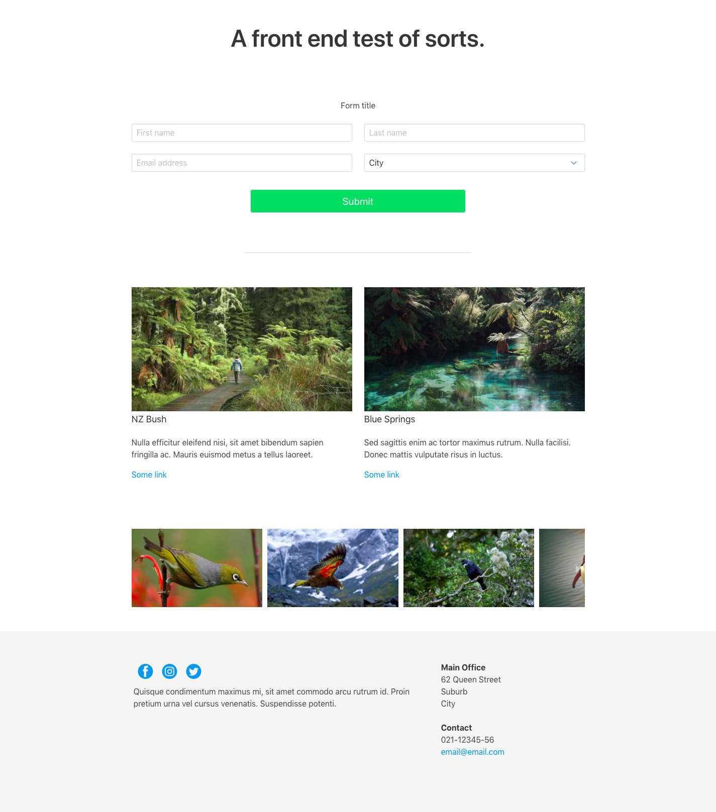
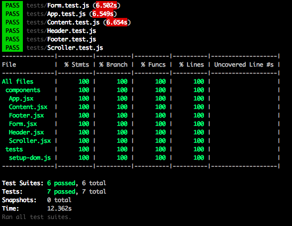

# Catch Technical Test - Usha MacDonald

---

## Setup

If you wish to run this repo locally, simply


Clone the repo:
```
git clone https://github.com/ushamacdonald/Frontend-Example
cd Frontend-Example
```

Install the Modules:
```
npm install
  - or -
yarn install
```

Run the App with webpack dev server (local testing):
```
npm start
 - or -
yarn start
```

If you wish to *build* the App (create the bundle.js file)
```
npm run build
  - or -
yarn build
```

Then open a browser and go to http://localhost:8081 to see the page.



---
## Testing
You may also run my Test-Suite (through Jest) to make sure everything is in order.

```
npm test
 - or -
yarn test
```

The test output should look like this:


